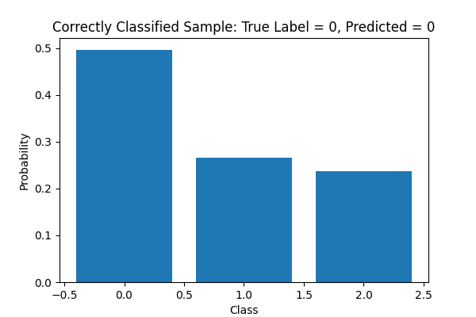
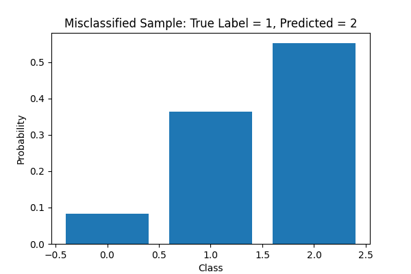

# Model Training Report

## Test Accuracy

Test Accuracy: 0.7000

## Confusion Matrix

[[10  0  0]
 [ 0  0  9]
 [ 0  0 11]]

## Plots

- [Accuracy and Validation Loss Plot](plots/accuracy_plot.png)
- [Validation Loss Plot](plots/val_loss_plot.png)
- [Confusion Matrix](plots/confusion_matrix.png)

## Sample Predictions

**Correctly Classified Sample:**

**Misclassified Sample:**

## Training History

|    |     loss |   accuracy |   val_loss |   val_accuracy |
|---:|---------:|-----------:|-----------:|---------------:|
|  0 | 1.41925  |   0.490741 |   1.09726  |       0.583333 |
|  1 | 1.46273  |   0.509259 |   1.05187  |       0.583333 |
|  2 | 1.45845  |   0.425926 |   1.01245  |       0.583333 |
|  3 | 1.26742  |   0.490741 |   0.977968 |       0.583333 |
|  4 | 1.1872   |   0.490741 |   0.948558 |       0.583333 |
|  5 | 1.37823  |   0.435185 |   0.922138 |       0.583333 |
|  6 | 1.1216   |   0.527778 |   0.898966 |       0.583333 |
|  7 | 1.19929  |   0.5      |   0.879579 |       0.583333 |
|  8 | 1.08324  |   0.546296 |   0.862384 |       0.583333 |
|  9 | 1.2113   |   0.453704 |   0.845393 |       0.583333 |
| 10 | 1.13938  |   0.527778 |   0.831447 |       0.583333 |
| 11 | 1.01042  |   0.537037 |   0.819344 |       0.583333 |
| 12 | 1.11107  |   0.462963 |   0.807577 |       0.583333 |
| 13 | 0.975127 |   0.509259 |   0.797626 |       0.583333 |
| 14 | 1.06333  |   0.518519 |   0.788546 |       0.583333 |
| 15 | 0.979534 |   0.564815 |   0.77955  |       0.583333 |
| 16 | 0.952339 |   0.555556 |   0.771136 |       0.583333 |
| 17 | 1.04738  |   0.5      |   0.763756 |       0.583333 |
| 18 | 0.972473 |   0.546296 |   0.756722 |       0.583333 |
| 19 | 0.942157 |   0.537037 |   0.750145 |       0.583333 |
